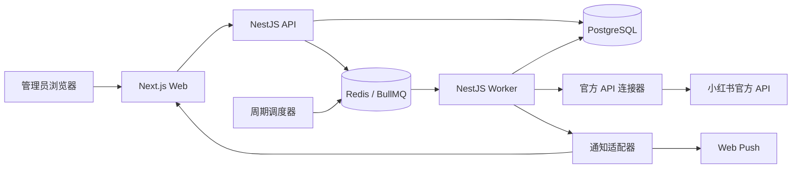

# 小红书官方 API 数据看板设计规格

## 1. 目标

构建一个面向企业内部使用的网页应用，通过小红书官方授权 API 管理多个已授权账号，定时同步笔记及互动数据，展示日报、周报、月报和评论明细，并在同步完成、发现新评论、授权失效或任务异常时及时通知用户。

第一版在尚未取得小红书官方 API 权限的情况下，使用契约一致的模拟连接器交付完整可运行流程。取得正式权限后，只替换连接器实现，不改动网页、业务服务和核心数据模型。

## 2. 合规边界

- 只接入小红书官方开放平台明确授权的接口和数据。
- 不使用网页 Cookie、浏览器自动化、隐藏接口、验证码绕过、风控规避或真人行为伪装。
- 不承诺获取官方 API 未开放、未授权、已删除、已折叠或不可见的数据。
- 产品自身不设置账号数量上限；实际账号数、调用频率和并发量服从官方应用配额及服务器资源限制。
- 页面必须区分“数值为零”“尚未同步”“等待官方授权”和“官方未提供”四种状态，禁止用零伪装缺失数据。

## 3. 第一版功能范围

### 3.1 账号中心

- 展示账号名称、头像、平台账号标识、授权来源、授权状态、最后同步时间和异常信息。
- 支持新增授权、重新授权、停用和删除本地账号关联。
- 第一版提供模拟扫码授权流程，用于验证产品体验；界面明确标注“演示授权”。
- 正式扫码或 OAuth 流程仅在官方文档提供对应能力后启用。
- 每个账号的令牌和授权状态相互隔离。

### 3.2 同步任务

- 支持立即同步、定时同步、暂停、继续和失败重试。
- 任务可按单账号、多个账号或全部启用账号执行。
- 同步对象包括官方授权范围内的笔记、指标、主评论和二级回复。
- 任务记录开始时间、结束时间、当前阶段、成功数、失败数、重试次数和错误摘要。
- 遵循官方限流响应，使用指数退避和带抖动的重试策略；鉴权失败不自动无限重试。

### 3.3 数据看板

- 总览卡片：笔记数、点赞、收藏、评论、曝光、浏览/访客，以及新增评论数。
- 趋势图：按日展示各项指标变化，可切换账号和笔记。
- 排行榜：按点赞、评论、收藏、曝光或官方实际提供的指标排序。
- 数据范围切换：日报、周报、月报及自定义时间范围。
- 每个指标展示数据来源、统计日期和最后同步时间。

### 3.4 笔记中心

- 展示笔记标题、封面、作者、发布时间、平台笔记标识、账号归属和最新指标。
- 支持按账号、日期、关键词和同步状态筛选。
- 进入详情后展示指标趋势、评论总览、同步历史及数据可用性说明。

### 3.5 评论中心

- 展示主评论及二级回复的树形关系。
- 保存官方评论标识、父评论标识、作者公开信息、内容、发布时间、点赞数、状态和首次/最后同步时间。
- 通过官方分页游标循环同步，保存断点并按平台评论标识幂等去重。
- 只有官方接口明确返回“无下一页”时，才能将本轮分页标记为完成。
- 评论完整度状态为：`同步中`、`本轮分页完成`、`等待授权`、`官方未提供`、`同步异常`、`无法验证`。
- “本轮分页完成”只表示已消费本轮官方接口返回的全部分页，不表示包含已删除、折叠、权限不可见或官方未返回的评论。
- 支持按账号、笔记、评论时间、关键词和新增状态筛选，并可导出当前授权范围内的数据。

### 3.6 通知中心

- 第一版支持网页内通知和浏览器系统通知。
- 通知事件包括：同步完成、同步失败、授权过期、发现新评论、评论同步异常、日报生成、周报生成和月报生成。
- 通知记录可标记已读，并链接到对应账号、任务、笔记或报告。
- 通知服务使用渠道适配器，后续可增加企业微信和邮件而不改动业务事件。

## 4. 报告周期和统计口径

所有业务时间使用 `Asia/Shanghai` 时区，数据库时间戳以 UTC 保存并在展示和统计时转换。

### 4.1 日报

- 每天生成前一个自然日的数据报告，即 T+1。
- 报告统计区间为昨天 `00:00:00` 至 `23:59:59`。
- 报告只使用该统计日对应的官方数据快照；若数据未到齐，标记为“待补全”并在后续同步后重算。

### 4.2 周报

- 每周一生成上一自然周的完整周报。
- 统计区间为上周一 `00:00:00` 至上周日 `23:59:59`。
- 第一版固定使用此规则，数据模型保留可配置周期字段，后续可调整。

### 4.3 月报

- 每月 1 日生成上一个自然月的完整月报。
- 统计区间为上月 1 日 `00:00:00` 至上月最后一天 `23:59:59`。
- 如果官方数据延迟，先生成“待补全”版本，并在数据到齐后自动重算和发送更新通知。

### 4.4 指标汇总

- 流量型指标按官方定义决定求和、期末值或去重值，连接器必须为每个指标提供聚合语义。
- 累计型指标以每日快照计算增量，避免跨日报、周报和月报重复累加累计总数。
- 报告保存生成时的数据版本、覆盖账号、缺失字段和重算记录，确保结果可追溯。

## 5. 系统架构

系统由以下边界清晰的模块组成：

1. **Web 客户端**：账号、任务、看板、笔记、评论、报告和通知界面。
2. **应用 API**：身份验证、查询、任务控制和浏览器通知订阅。
3. **官方 API 连接器**：封装授权、分页、限流、字段映射和能力探测。
4. **同步编排器**：创建任务、分阶段执行、断点续传、重试和状态推进。
5. **报告服务**：按 T+1、自然周和自然月生成可追溯报告。
6. **通知服务**：消费业务事件并分发网页和浏览器通知。
7. **任务队列与调度器**：执行定时同步、报告生成和重算任务。
8. **PostgreSQL**：保存业务数据、快照、游标、报告、通知和审计记录。

### 5.1 技术栈

- **Monorepo**：pnpm workspace，按应用和共享包拆分代码。
- **Web 客户端**：Next.js App Router、React、TypeScript、Tailwind CSS、shadcn/ui、Apache ECharts。
- **应用 API**：NestJS、TypeScript、REST、OpenAPI。
- **后台 Worker**：NestJS 独立进程，消费 BullMQ 任务。
- **数据库**：PostgreSQL、Prisma ORM；数据规模达到需要时再为快照和评论表启用原生分区。
- **任务与缓存**：Redis、BullMQ。
- **通知**：站内通知、Web Push；渠道适配器预留企业微信和邮件。
- **测试**：Vitest、Playwright。
- **本地和首期部署**：Docker Compose，分别运行 Web、API、Worker、PostgreSQL 和 Redis。

### 5.2 运行架构



Web 只负责交互和数据展示，不直接持有官方凭证。API 负责权限、查询和任务控制；耗时同步、评论分页和报告生成全部由 Worker 执行，避免网页请求超时。Redis 保存任务状态和调度信息，PostgreSQL 是业务数据的唯一事实来源。

### 5.3 代码边界

```text
apps/
  web/                 网页和浏览器通知
  api/                 REST API、管理员登录和任务控制
  worker/              同步、报告和通知任务
packages/
  database/            Prisma 模型、迁移和数据库访问
  connector/           连接器契约、模拟连接器和正式连接器
  domain/              指标、评论、报告和任务领域规则
  shared/              公共类型、校验和工具
```

`apps` 只能通过 `packages` 暴露的接口使用共享能力，不能跨应用导入内部文件。官方 API 的字段只存在于连接器边界内，进入业务层前必须转换为统一领域模型。

连接器暴露稳定接口：

- `getCapabilities()`：返回当前应用和账号获批能力。
- `beginAuthorization()` / `completeAuthorization()`：启动并完成官方授权。
- `listNotes()`：分页获取授权范围内的笔记。
- `getNoteMetrics()`：获取笔记指标及指标语义。
- `listComments()`：分页获取主评论。
- `listReplies()`：分页获取二级回复。
- `refreshCredential()`：刷新或验证授权。

模拟连接器和正式连接器实现同一契约，模拟数据必须标记来源，且不能混入正式报告。

## 6. 核心数据模型

- `accounts`：本地账号、平台账号标识、状态和来源。
- `credentials`：加密后的令牌引用、过期时间和授权范围。
- `connector_capabilities`：账号或应用实际可用的官方能力。
- `notes`：笔记基础信息和归属账号。
- `metric_definitions`：指标名称、单位、聚合语义和数据可用性。
- `metric_snapshots`：账号/笔记在统计日期的指标快照。
- `comments`：主评论和回复，使用父评论标识表达树形关系。
- `sync_jobs` 与 `sync_steps`：任务及各阶段状态、游标和错误。
- `reports` 与 `report_metrics`：报告区间、版本、完整度和指标结果。
- `notifications`：通知类型、目标、已读状态和投递状态。
- `audit_logs`：授权、配置变更和敏感操作记录。

所有平台对象使用“连接器类型 + 平台对象标识”作为唯一性边界，确保重复同步不会产生重复记录。

## 7. 数据流

1. 用户在账号中心发起官方授权或演示授权。
2. 系统保存授权结果并调用能力探测。
3. 调度器创建同步任务，编排器按账号依次同步笔记、指标和评论。
4. 连接器处理官方分页和限流，编排器持久化游标与阶段状态。
5. 数据服务执行幂等写入并生成指标快照。
6. 新评论或状态异常发布业务事件，通知服务立即投递。
7. 报告调度器按上海时区生成日报、周报和月报；缺失数据到齐后自动重算。
8. Web 客户端通过应用 API 查询最新数据和任务状态。

## 8. 错误处理

- `401/403`：将授权标记为过期或权限不足，停止该账号相关任务并通知用户。
- `429`：读取官方重试提示；没有提示时使用指数退避，并限制最大重试次数。
- `5xx/网络错误`：可重试，达到上限后保留游标并将任务标记为失败。
- 字段缺失：记录为官方未返回，不以零补齐。
- 分页游标异常或重复：停止当前分页，标记“无法验证”，避免无限循环。
- 部分账号失败：其他账号继续执行，最终任务状态显示部分成功。
- 报告数据缺失：生成待补全版本，不阻塞后续周期报告；补数后重算。

## 9. 安全与隐私

- 正式凭证只保存在服务端，使用环境密钥加密，不进入前端代码、日志或版本库。
- 日志对令牌、手机号和其他敏感字段脱敏。
- 删除账号关联时撤销可撤销的官方授权，并删除本地凭证；业务数据按配置的保留策略处理。
- 所有修改账号授权、任务配置和通知设置的操作写入审计日志。
- 第一版采用单管理员登录模型，为后续多用户和角色权限预留所有者字段。

## 10. 页面结构

- `/dashboard`：今日状态、昨日数据、趋势、排行榜、异常和最新通知。
- `/accounts`：账号列表、授权状态及新增授权。
- `/jobs`：同步任务、进度、失败原因和重试。
- `/notes`：笔记列表和筛选。
- `/notes/:id`：笔记指标趋势、评论和同步历史。
- `/comments`：跨账号评论中心。
- `/reports`：日报、周报、月报列表及详情。
- `/notifications`：通知收件箱。
- `/settings`：同步计划、报告周期只读说明和通知设置。

第一版桌面端优先，同时保证平板和手机可完成查看、筛选及任务重试。

## 11. 测试与验收

### 11.1 自动化测试

- 连接器契约测试：模拟连接器必须覆盖正式连接器所需的全部契约行为。
- 评论测试：多页主评论、二级回复、重复数据、断点恢复、空页和异常游标。
- 指标测试：累计值转增量、缺失值、零值和不同聚合语义。
- 报告测试：跨周、跨月、闰年、上海时区边界、延迟补数和重复重算。
- 任务测试：限流、鉴权失败、部分成功、重试上限和幂等性。
- 通知测试：事件去重、已读状态、浏览器权限拒绝和投递失败。
- 页面测试：主要筛选、空状态、错误状态和完整用户流程。

### 11.2 第一版验收标准

- 可以完成演示账号授权并看到能力状态。
- 可以创建同步任务，并在刷新页面后继续看到可靠进度。
- 模拟连接器可同步多页笔记、指标、主评论和二级回复，重复运行无重复数据。
- 评论中心能展示分页完成和无法验证等明确状态。
- 看板能区分真实零值与未授权/未提供数据。
- 每天生成昨天日报，每周一生成上周一至周日周报，每月 1 日生成上月月报。
- 延迟数据到齐后能重算报告并生成通知。
- 网页通知和浏览器通知能响应同步、评论和报告事件。
- 全部自动化测试通过，主要页面在桌面和手机尺寸下无阻断问题。

## 12. 正式 API 接入门槛

取得官方权限后，接入前必须获得并确认以下材料：

- 官方接口目录及版本。
- 官方授权流程及令牌刷新规则。
- 笔记、指标、评论和回复接口的请求与返回定义。
- 分页、时间范围、历史数据和删除状态语义。
- 调用配额、并发限制和限流响应规则。
- 测试环境、回调要求、IP 或域名配置要求。

若官方能力与本规格不同，应更新连接器能力映射和页面可用性说明；不得以非官方抓取补齐。
